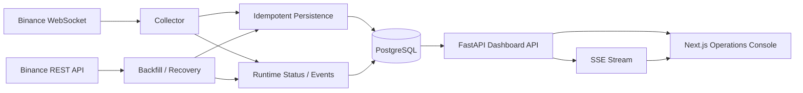

# 02. Architecture

## Overview

## Components
- Collector: consumes Binance WebSocket 1m candle updates.
- Backfill / Recovery: fills empty DB and missing ranges using REST.
- Persistence: enforces unique candle identity.
- FastAPI: exposes dashboard data and SSE.
- Next.js: renders operations console.

## Update Rule
Architecture changes require this document, `PRODUCT.md`, and affected design docs to be updated.

## Open Decisions
- Process model for collector and API in local Docker.
- Whether recovery runs synchronously on startup or as a background job.
- SSE event shape.
