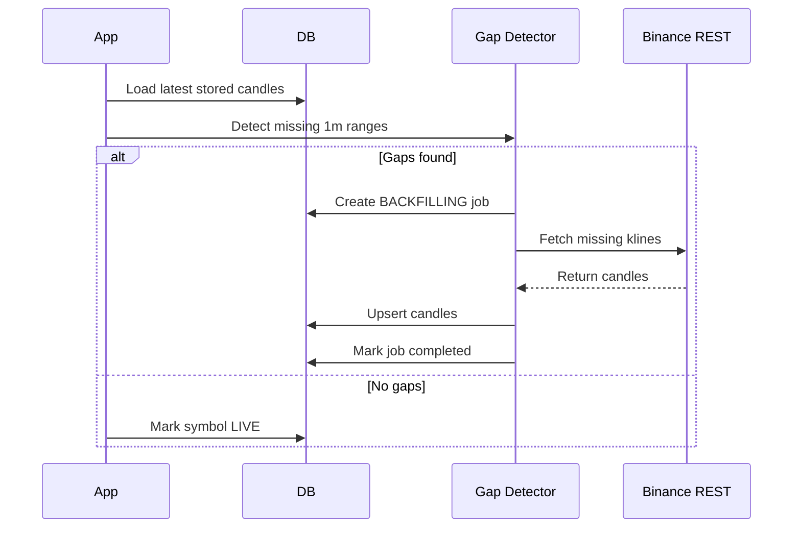

# 04. Backfill and Recovery

## Fixed Design
- Initial backfill runs when no candles exist for a symbol.
- Initial backfill fetches the recent `INITIAL_BACKFILL_HOURS` window, defaulting to 24 hours.
- Initial backfill writes candles with `source=rest_backfill` through the repository's idempotent upsert path.
- Restart recovery scans for missing 1m ranges and fills them through REST.
- Backfill jobs are recorded with type, symbol, interval, range, status, counts, and errors.
- Candle writes are idempotent, so repeated backfill is safe.

## Recovery Flow

## Drill Contract
`scripts/recovery-drill.sh` must eventually prove gap creation, detection, REST repair, LIVE recovery, zero missing candles, and zero duplicates.

## Update Rule
Any recovery behavior change must update this document and the drill.

## Open Decisions
- Maximum REST page size and pagination strategy.
- How far back restart recovery should scan.
- Retry limit before ERROR state.
