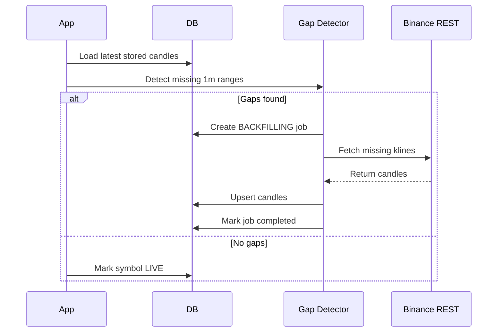

# 04. Backfill and Recovery

## Fixed Design
- Initial backfill runs when no candles exist for a symbol.
- Initial backfill fetches the recent `INITIAL_BACKFILL_HOURS` window, defaulting to 24 hours.
- Initial backfill writes candles with `source=rest_backfill` through the repository's idempotent upsert path.
- Restart recovery scans for missing 1m ranges and fills them through REST.
- Backfill jobs are recorded with type, symbol, interval, range, status, counts, and errors.
- Candle writes are idempotent, so repeated backfill is safe.
- Restart recovery consumes gap detection results and only requests/restores missing gap ranges.
- Restart recovery writes recovered candles with `source=rest_backfill` through repository bulk upsert.

## Recovery Flow

## Drill Contract
`scripts/recovery-drill.sh` proves gap creation, detection, REST repair, LIVE recovery, zero missing candles, and zero duplicates against a running system.

The drill:
- checks backend, frontend, SSE, and DB readiness;
- records starting latest candle, row count, and duplicate count;
- injects a real gap by deleting recent completed candles for `DRILL_SYMBOL`;
- verifies the dashboard gap API reports missing candles;
- triggers recovery via `DRILL_RECOVERY_TRIGGER_URL` or `DRILL_RECOVERY_COMMAND`;
- waits for a `restart_recovery` job to complete;
- verifies missing count returns to 0, symbol status returns to LIVE, recovery events exist, and duplicate rows remain 0.

The script requires either host `psql` with `DATABASE_URL` or Docker Compose access to the `postgres` service. Collector pause/resume controls are optional through `DRILL_COLLECTOR_PAUSE_URL` and `DRILL_COLLECTOR_RESUME_URL`; without them, the drill uses deterministic DB gap injection and reports the collector control step as skipped.

## Update Rule
Any recovery behavior change must update this document and the drill.

## Open Decisions
- Maximum REST page size and pagination strategy.
- How far back restart recovery should scan.
- Retry limit before ERROR state.
